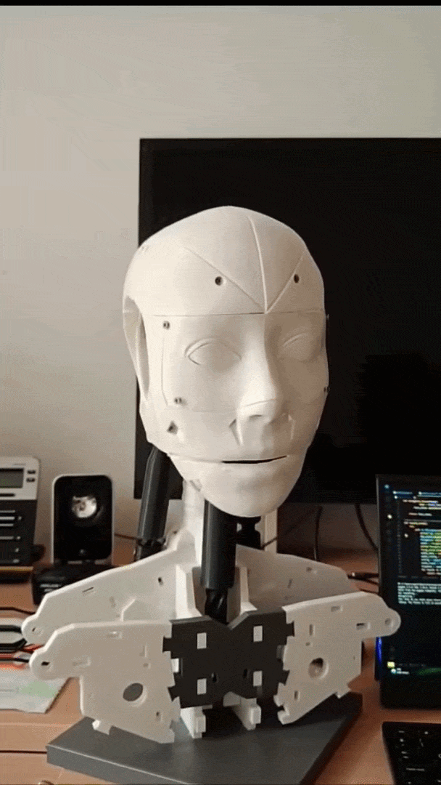
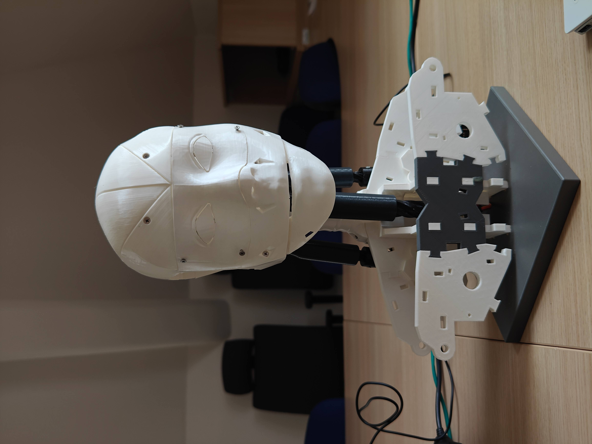
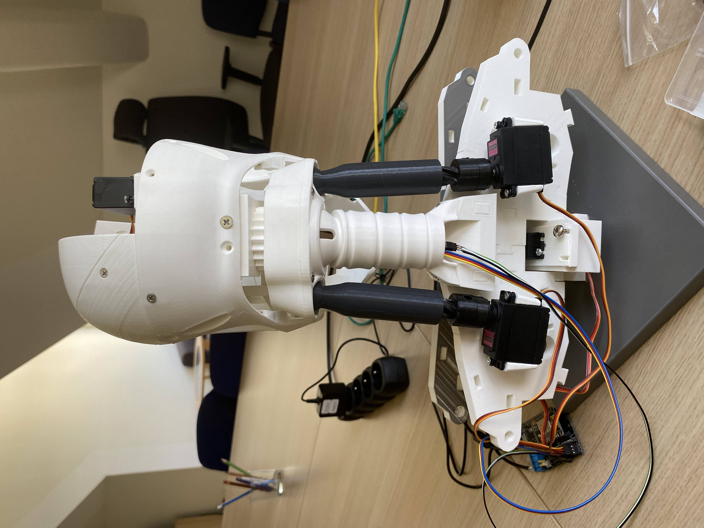
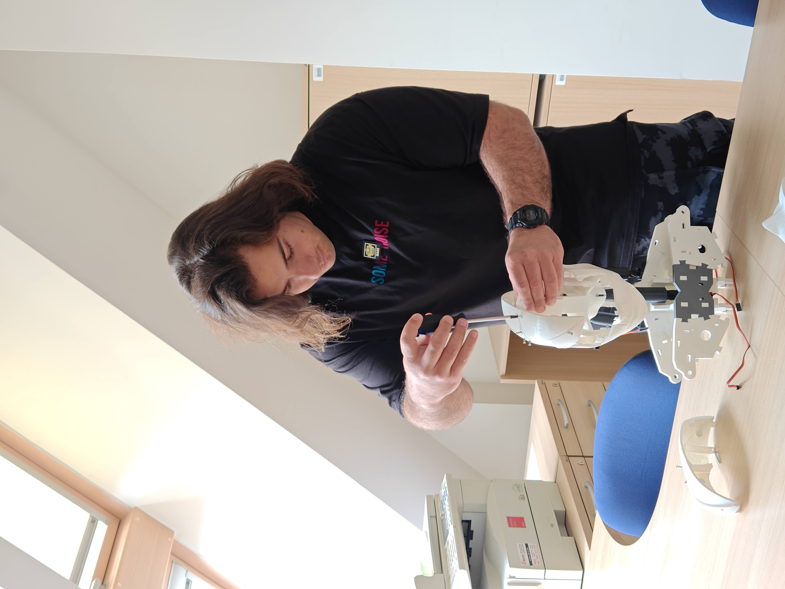

# 🤖 Johnny Humanoid Robot — AI & Embedded Integration Showcase

> **Note:** The source code for this project is private. This repository documents the hardware integration, serial synchronization, and cloud AI architecture.

---

## 📌 Project Overview
**Johnny** is an AI-driven, 3D-printed humanoid robot built on the INMOOV mechanical platform. The project focused on synchronizing cloud-based generative language models with Arduino microcontrollers to generate speech-synchronized physical gestures in real-time.

  <!-- width değeri 700'den 400'e düşürülerek kutu boyutu küçültüldü -->
  

---

## 🏗️ Hardware-to-Cloud Pipeline

The interaction loop is designed to be seamless and responsive:

1. **Input Capture:** The onboard microphone and camera array capture the user's spoken queries and physical presence.
2. **Orchestration:** A Python-based core architecture receives the raw audio/video streams and packages them with sensor context.
3. **Cloud Processing:** The packaged prompt is sent to **Google Vertex AI** (chat-bison) to generate a context-aware response stream.
4. **Parallel Execution:**
   * **Audio:** The Python core processes the text through a TTS engine and outputs spoken audio to the user.
   * **Motion Synchronization:** Simultaneously, the Python core translates the response into serial command packets (UART) and sends them to the Arduino microcontroller.
5. **Actuation:** The Arduino translates the serial commands into coordinated PWM signals, driving the servo actuators for real-time physical gestures.

---

## 🛠️ Key Technical Implementations

### 1. Cloud-to-Hardware Synchronization
* **Conversational AI:** Integrated Google Vertex AI to power natural language dialogue.
* **Serial Protocol:** Designed a Python-to-Arduino UART communications pipeline to translate text tokens and intent into specific motor angles efficiently.

### 2. Mechanical & Sensor Integration
* **3D Assembly:** Integrated, wired, and calibrated 3D-printed mechanical components, servo horns, and linkages.
* **Computer Vision:** Positioned camera inputs to support basic visual awareness and interaction triggers during conversations.

---

## 📸 Media Gallery

  
  &nbsp;
  

  

---

## 📬 Contact
For technical questions or further architectural details:
* **Email:** [omerfaruk.kus@outlook.com](mailto:omerfaruk.kus@outlook.com)
* **LinkedIn:** [linkedin.com/in/omrfrkkus](https://linkedin.com/in/omrfrkkus)
